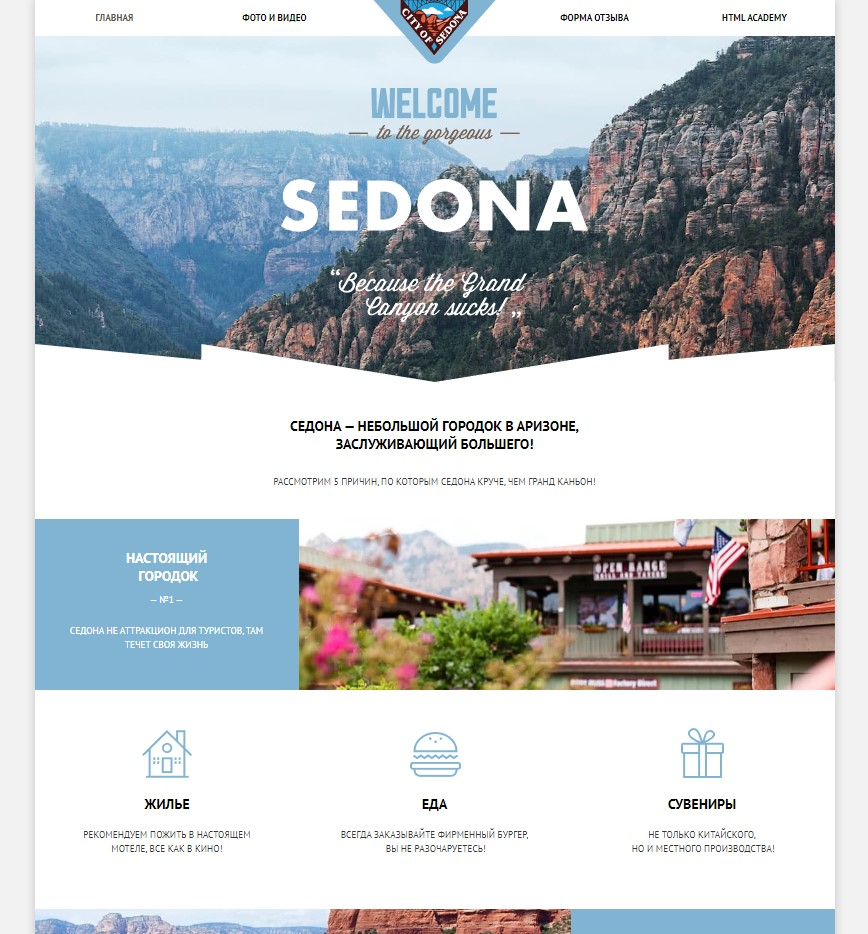
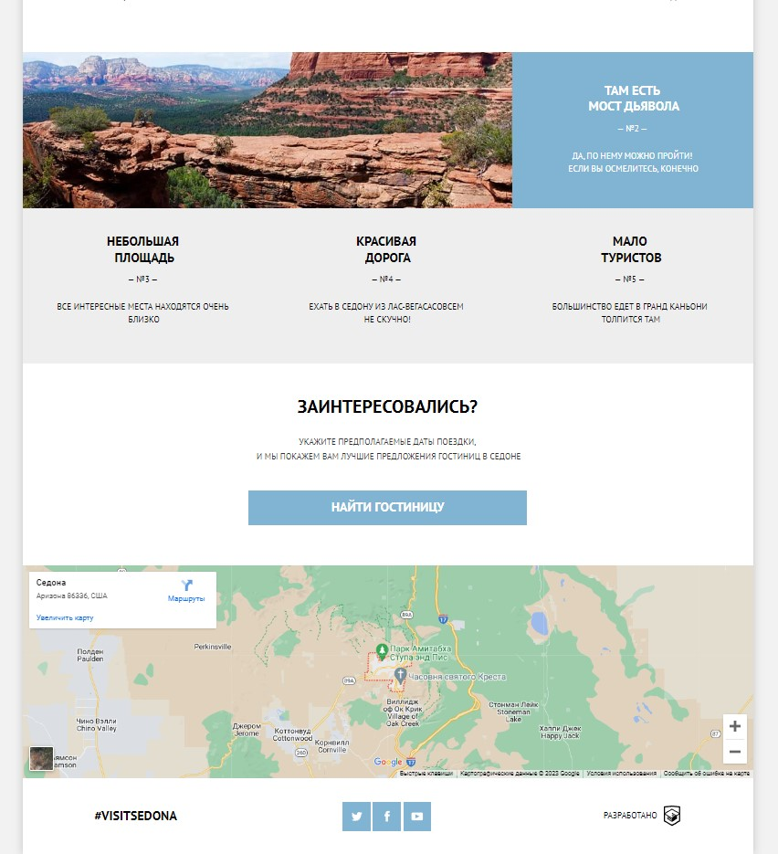
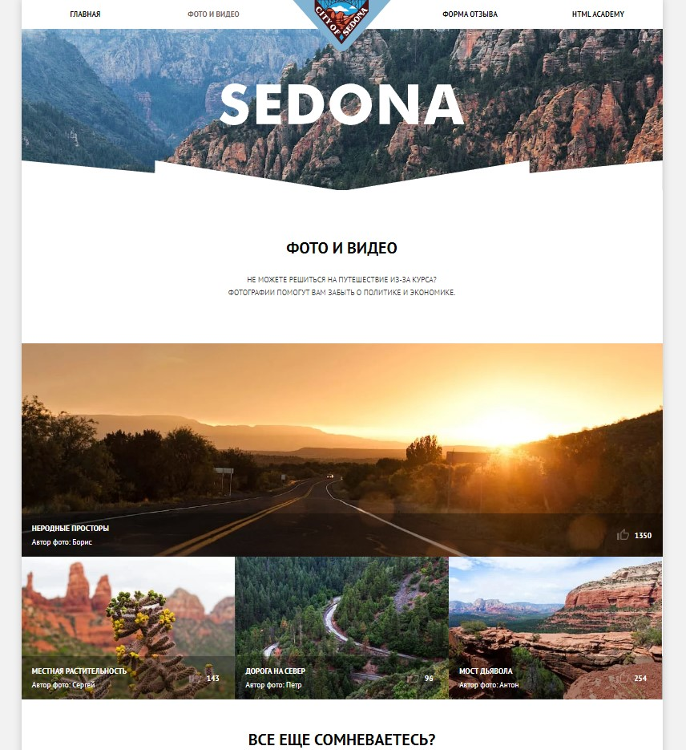
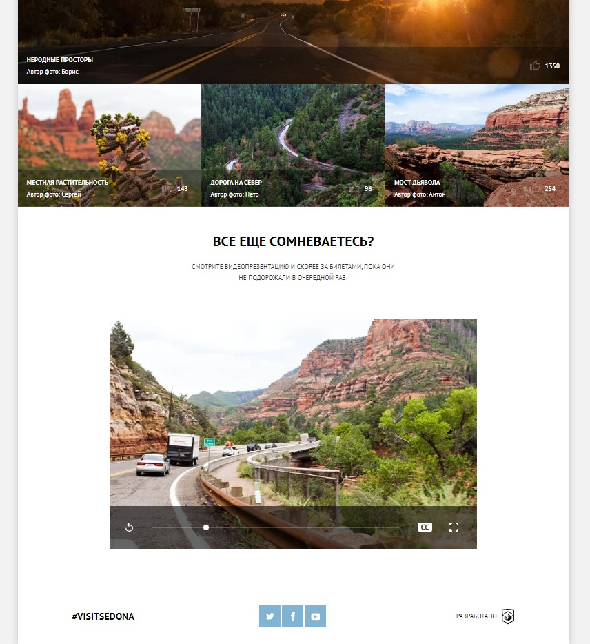
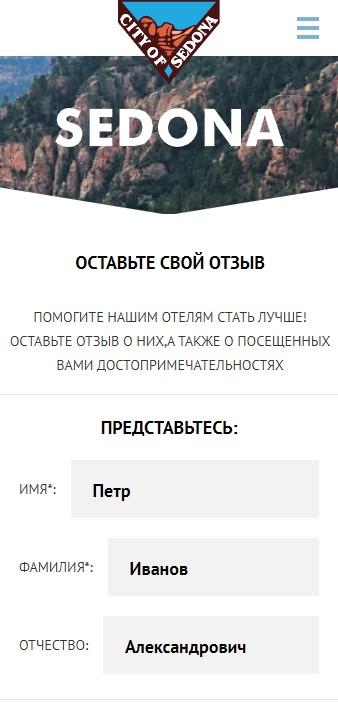
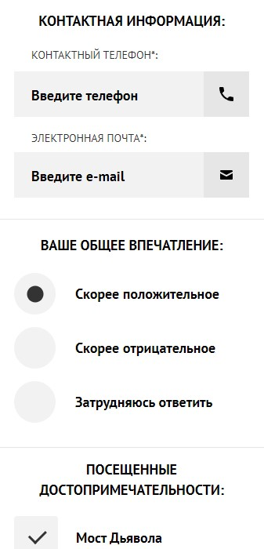
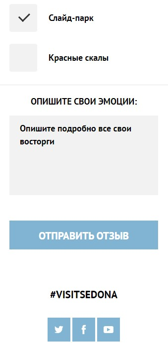

# Верстка для сайта туристического города "Седона"

> Личный учебный проект по курсу "HTML и CSS. Адаптивная вёрстка и автоматизация" от HTML Academy

## Описание

- Проект:
  - имеет респонсивную верстку
  - выполнен полностью самостоятельно на HTML5, SASS и JS
  - собран с помощью Gulp
  - проверен на соответствие техническому заданию и критериям академии
  - сверстан по макету Figma
  - имеет автоматизированную через Gulp оптимизацию графики
  - проходит проверку по Pixel Perfect

## Скриншоты

### Главная страница - верхняя часть



### Главная страница - нижняя часть



### Галерея - верхняя часть



### Галерея - нижняя часть



### Отзыв - верхняя часть(мобильная версия)

<p align="center">
  
</p>
### Отзыв - средняя часть(мобильная версия)

<p align="center">
  
</p>
### Отзыв - нижняя часть(мобильная версия)

<p align="center">
  
</p>

## Установка

Чтобы запустить проект локально, используйте npm (CLI Node.js):

```
$ npm install
$ npm start
```

Для производственной сборки

```
$ npm run build
```
